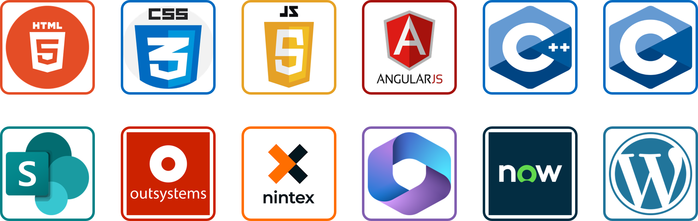

### 👋 Hi there, want to know more about me? Keep scrolling...
I am a graduate of Electrical Electronics Engineering who loves to code with the goal of becoming a Software Engineer that develops software to automate your everyday repetitive tasks

### ✔️ My areas of expertise are
| Low Code Solutions | Website Development | Front End Developer |
| :---: | :---: | :---: |
| | ||
|Automate paper-based forms using low code solutions | Use WordPress to build websites and in-house apps | Develop front end using Angularjs, Rest APIs and much more |

### 🖥️ Skills up my sleeve
---
 

### 📖 My Learning Journey thus far
---
1. <a href="https://www.linkedin.com/in/hanson-udy-akpan-4b47909/">Udy Akpan</a>: Introduced me to low-code solutions using **InfoPath** and **SharePoint 2013**. Currently, I can build apps with low-code platforms such as **OutSystems, Nintex and Power Apps.**
2. <a href="https://www.linkedin.com/in/nsisongeffiong/">Nsisong Effiong</a>: Introduced me to static website development using **HTML5, CSS and WordPress**.
3. Clarence Ifudu: Threw me to the sharks with a request to build an **AngularJs** app hosted on SharePoint using **Rest API** in 3 days and I delivered 😂.
4. <a href="https://hevodata.com/learn/author/ofem-eteng/">Ofem Eteng</a> && <a href="https://www.linkedin.com/in/abdulazeezbolarinwa/">Abdulazeez Bolarinwa </a>: Introduced me to front-end development, containers, hosting outside SharePoint and generally my flare for wanting to pursue **Software Engineer**. With them, I realised there was more to learn and achieve if only I could code.
5. <a href="https://www.alxafrica.com/">ALX Africa</a>: Completed a one year software engineering certificate program. Milestones achieved are <a href="https://lagra-iku.github.io/aqua_manager/">AquamanagerApp</a> and <a href="https://www.youtube.com/watch?v=Gg6VSgqnTaY">CrimeWatchApp</a>

    🌱 I’m currently learning ...
    - DevOps

### 🔭 I’m currently working on ...
- A saas for hotel management
- A webapp for managing suspects

### 📫 How to reach me: ...

  
 <!-- -->
  

<!---->

<!--
**lagra-iku/lagra-iku** is a ✨ _special_ ✨ repository because its `README.md` (this file) appears on your GitHub profile.

- 🌱 I’m currently learning software Engineering with ALX Africa 
- Here are some ideas to get you started:

- 🔭 I’m currently working on ...
- 🌱 I’m currently learning ...
- 👯 I’m looking to collaborate on ...
- 🤔 I’m looking for help with ...
- 💬 Ask me about ...
- 📫 How to reach me: ...
- 😄 Pronouns: ...
- ⚡ Fun fact: ...
-->
